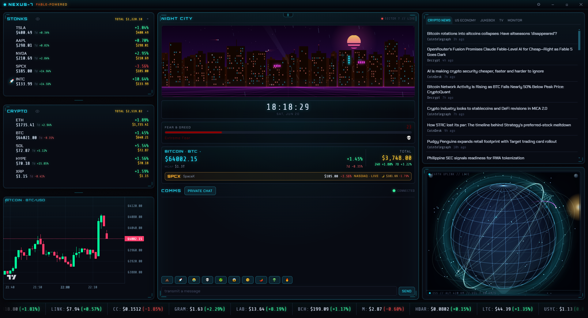

# NEXUS-7

> A cyberpunk command deck for crypto and stocks. Live markets, encrypted comms, and a holographic sky, running on your desktop.

[](LICENSE)
[](#quick-start)
[](https://www.electronjs.org/)
[](https://www.typescriptlang.org/)

Around-the-clock prices, retro-future neon, and a wall of public webcams. NEXUS-7 turns live market data into a noir operations center: real-time crypto and stock tickers, a Bitcoin command center, a wireframe holographic globe tracking real satellites, an end-to-end encrypted group chat, free internet radio, and an animated synthwave skyline. Everything runs off public APIs. No accounts, no API keys, no telemetry. Just a window into the night side of the market.

Built with Electron, Vite, and TypeScript. Ships as a single portable Windows executable (no installer).

## Features

### Asset boxes (STONKS and CRYPTO)

- Two editable boxes: STONKS for stocks and CRYPTO for crypto, with live prices and 24h / 7d changes.
- Click to add, remove, or re-point any asset.
- Editable holdings (quantity per asset) feed a combined-portfolio TOTAL cell.
- Privacy mode blurs dollar values and the portfolio total while leaving prices and percentages visible.

### Command center

- A featured asset (Bitcoin by default, re-pointable) with a big live price, market cap, and 24h / 7d change.
- A live Fear and Greed gauge.
- A live candlestick chart powered by lightweight-charts.
- A bottom scrolling market ticker.
- A gold "second slot" card (SpaceX SPCX by default, re-pointable).

### Ambient scenes

- GLOBE: a wireframe holographic Earth with real satellites and the ISS, plus an 8-level zoom-out that recedes through Earth, cislunar space, the solar system, the Milky Way, the Local Group, the observable universe, the multiverse, and the dimensional planes. Occasional meteors arrive with shockwave impacts.
- NIGHT CITY: a synthwave skyline with a rare alien UFO flyover and an ULTRA neon mode.
- Either scene can be swapped or hidden.

### Right panel tabs

- Crypto News and US Economy: live RSS feeds.
- Jukebox: free 24/7 internet radio (Nightride FM synthwave plus SomaFM stations).
- TV: a finance live stream.
- MONITOR: rotating 24/7 public webcams, including the ISS live Earth feed, plus city and nature cams.

### Encrypted group chat (COMMS)

- A built-in PUBLIC room shared by everyone running NEXUS-7.
- PRIVATE rooms gated by a shared passphrase.
- AES-GCM end-to-end encryption via WebCrypto, transported over public MQTT brokers.
- The MQTT socket runs in the Electron main process, so chat works on restricted networks. Encryption stays client-side.
- Quick-send emoji.

### Settings and chaos

- Settings gear in the titlebar: upload your own images (multi-select, auto-downscaled), pick assets and holdings, and more.
- Reactive "chaos": price-driven banners, accent recolor on pumps and dumps, and your uploaded images drifting in as overlays, all contained so they never break the layout.
- Respects `prefers-reduced-motion`.

## Screenshots

Screenshots go here. Add images under `docs/` and link them in this section.



## Quick Start

Requirements: Node 20 or newer, on Windows.

```bash
npm install
npm run dev
```

`npm run dev` launches Vite and the Electron shell together (the full desktop app).

For a browser-only preview (no Electron shell, useful for quick UI work):

```bash
npm run dev:web
```

Note: features that depend on the Electron main process (the MQTT chat socket, settings persistence) are limited or unavailable in the browser-only preview.

## Build a portable .exe

```bash
npm run build:exe
```

The portable Windows executable is written to `dist/NEXUS-7-<version>.exe`. It is a single self-extracting exe: double-click to run, with no installer and no admin prompt. Settings persist in `%APPDATA%\NEXUS-7`.

The build is unsigned, so Windows SmartScreen may show a "Windows protected your PC" prompt the first time you run it. Click "More info" and then "Run anyway". This is normal for indie apps that are not code-signed.

## Tests

```bash
npm test
```

`npm test` runs the unit suite (Vitest). The unit tests use no network.

```bash
npm run selftest
```

`npm run selftest` runs live checks against the real data sources (CoinGecko, Yahoo Finance, RSS feeds, Celestrak, and so on). These need an internet connection and may be flaky if an upstream source is down, so they are kept separate from the unit tests.

## Configuration

Open the Settings gear in the titlebar to configure:

- Assets: pick your own coins and tickers for each of the two asset boxes, set the featured center asset and the gold second slot, and enter your holdings.
- Images: the app ships with no images; add your own to the overlay pool from Settings (multi-select, auto-downscaled). They drift in over the dashboard and appear on big BTC moves.
- Chat rooms: switch between the built-in PUBLIC room and a PRIVATE room. A private room is just a shared passphrase: everyone who types the same phrase lands in the same encrypted channel.
- Scenes, privacy mode, and panel layout.

### First-run seed (optional)

On first launch the app looks for `resources/seed-settings.json`. If that file is absent (the normal case for a fresh checkout), the app falls back to its built-in defaults and boots fine. A neutral demo seed ships as `resources/seed-settings.example.json`. To start from it, copy it to `resources/seed-settings.json` before running or building. Personal seed files are gitignored so they never get published.

## Privacy and Security

- No telemetry, no accounts, no API keys. NEXUS-7 does not phone home. All market data comes from public APIs.
- The PUBLIC chat room's key ships inside the app. By design, every copy of NEXUS-7 derives the same key and topic, so anyone running NEXUS-7 can read messages in the public room. There is no history and no moderation. For anything sensitive, use a PRIVATE room with a passphrase you share out of band.
- Private rooms use AES-GCM with a key and topic derived from your passphrase via PBKDF2 (WebCrypto). The passphrase is stored locally and is never sent or logged. Encryption happens client-side.
- The app embeds remote YouTube iframes (the TV and MONITOR tabs) and connects to public MQTT brokers for chat. See [SECURITY.md](SECURITY.md) for details.

## Tech stack

- Electron 33
- Vite 6
- TypeScript 5 (strict mode)
- lightweight-charts (candlestick chart)
- mqtt (encrypted chat over WSS)
- yahoo-finance2, rss-parser (data adapters)
- Vitest (unit tests)
- electron-builder (portable Windows build)

### Data sources

All public APIs, no keys required:

- CoinGecko and DexScreener (crypto)
- Yahoo Finance (stocks)
- Alternative.me (Fear and Greed index)
- Celestrak (satellite orbital data)
- Coinbase (live BTC price)
- RSS feeds (news and economy), plus Nightride FM and SomaFM (radio)

## Contributing

Contributions are welcome. See [CONTRIBUTING.md](CONTRIBUTING.md) to get started.

## License

MIT. See [LICENSE](LICENSE). The copyright line reads "2026 beeswaxpat"; change it to your own name if you fork this.
